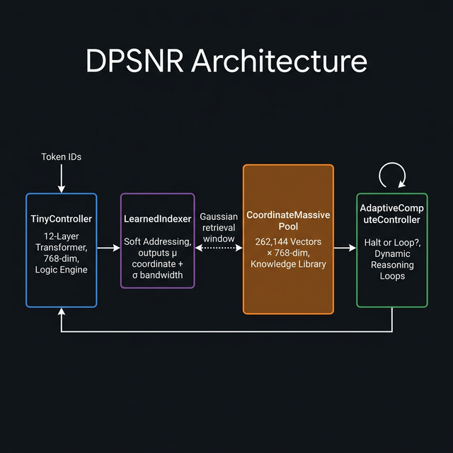
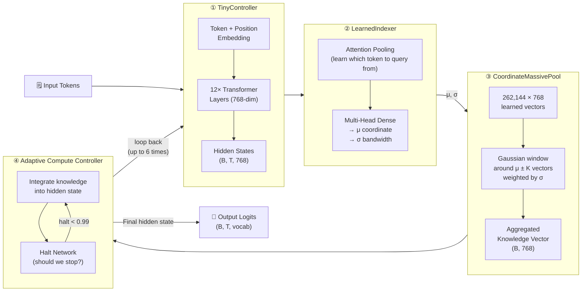
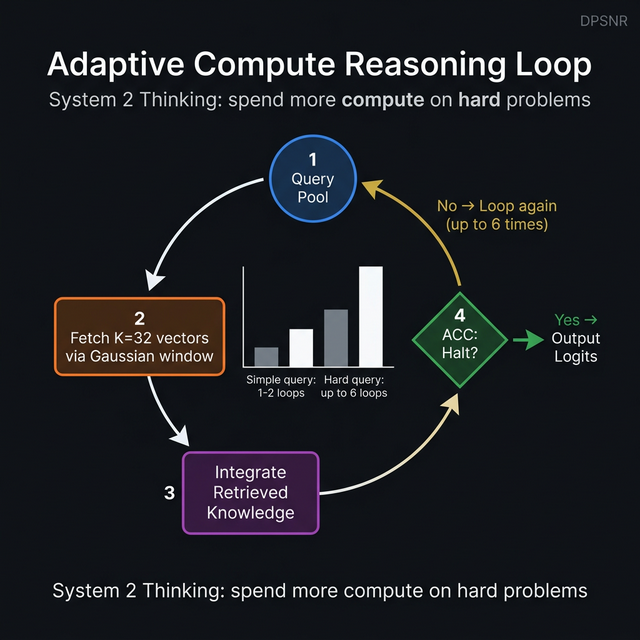
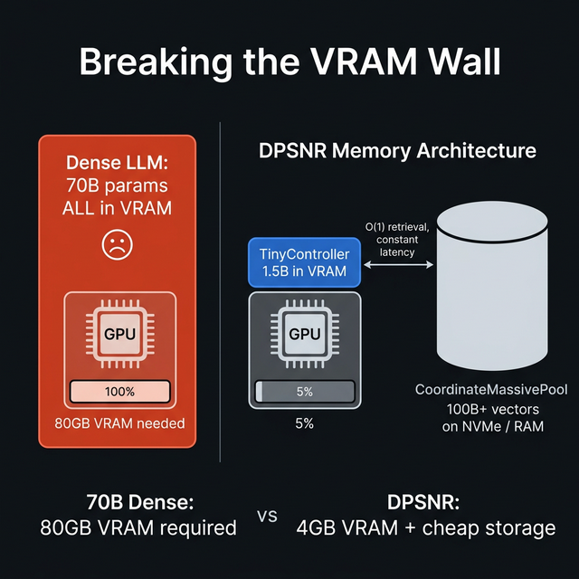
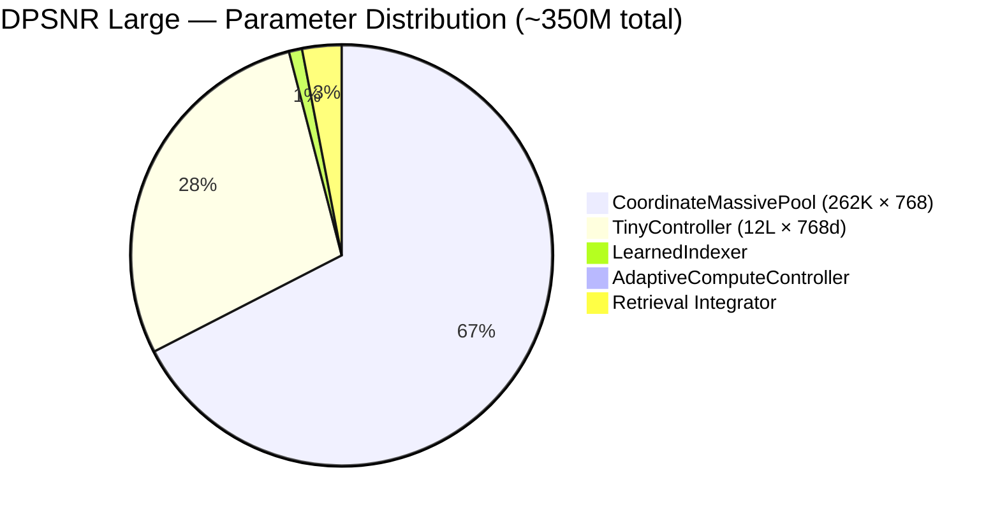
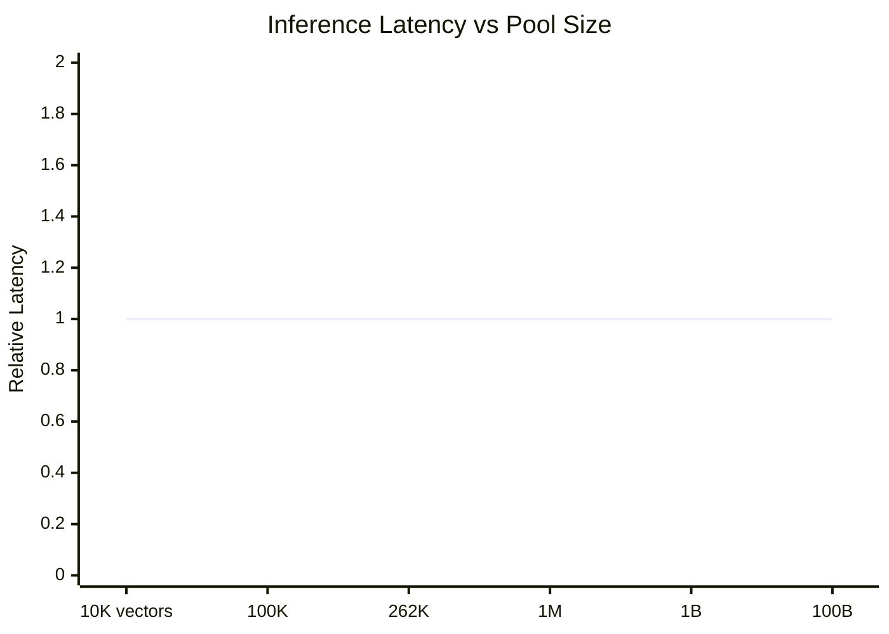

# DPSNR — Dynamic Parameter Selection Network with Reasoning

> **A JAX/Flax language model that separates *what it knows* from *how it thinks* — so the knowledge can grow to 100B+ vectors while inference stays fast and cheap.**

[](https://colab.research.google.com/drive/1VM64IOZHj5rDvxWPbqktC037LlyOJih3?usp=sharing)

> [!WARNING]
> **Disclaimer**: This repository and checkpoint are provided as a **research proof-of-concept to demonstrate the novel DPSNR architecture**. It is an experimental model trained on a limited compute budget (for ~31,000 steps) to validate theoretical claims (such as $O(1)$ retrieval scaling, Sparse Adam optimizer speedups, and memory-bandwidth properties). **It is NOT a fully-trained competitive model** and is not intended to compete with state-of-the-art open-source text models (like LLaMA or Mistral) on downstream benchmarks.

---

## What Is DPSNR?

Normal large language models (GPT, Llama, etc.) mix logic and facts together inside the same transformer weights. When you want more knowledge, you need more parameters, which means more GPU VRAM, more compute, more cost — the **VRAM Wall**.

DPSNR breaks that wall. It splits the model into two parts:

| Part | Role | Size |
|------|------|------|
| **TinyController** | Does the thinking / reasoning | ~350M params on GPU |
| **CoordinateMassivePool** | Stores world knowledge as vectors | 262K–1T+ vectors, can live on disk |

The controller *queries* the pool each reasoning step instead of storing facts in its weights. Pool size can grow arbitrarily; inference cost stays **O(1)**.

---

## Architecture Overview



The model has **4 components** that work together:



---

## How the Reasoning Loop Works

Instead of doing one pass like most LLMs, DPSNR thinks iteratively — like a human reading and re-reading a hard problem.



Each loop:
1. **TinyController** encodes the input → produces a hidden state
2. **LearnedIndexer** converts the hidden state into a *coordinate* (μ) and *uncertainty* (σ)
3. **CoordinateMassivePool** retrieves K=32 knowledge vectors near μ, weighted by a Gaussian of width σ
4. Retrieved knowledge is fused into the hidden state
5. **ACC** decides: confident enough? → output. Unsure? → loop again

Simple questions finish in 1–2 loops. Hard questions use all 6. Compute is spent where it's needed.

---

## Breaking the VRAM Wall



A 70B dense model requires 80GB+ of expensive HBM VRAM just to load. Because DPSNR stores knowledge as a flat array of vectors (not entangled with transformer weights), the pool can live in:

- **System RAM** — 64GB RAM holds ~130M vectors × 768-dim at float32
- **NVMe SSD** — mmap'd; only the retrieved window is paged in
- **GPU VRAM** — only the TinyController (~1.3GB at bf16) needs the GPU

```
Dense 70B:  [GPU|▓▓▓▓▓▓▓▓▓▓▓▓▓▓▓▓ 80GB VRAM ▓▓▓▓▓▓▓▓▓▓▓▓▓▓▓▓]
DPSNR:      [GPU|▓ 4GB]  +  [RAM|▓▓▓▓▓▓ Pool ▓▓▓▓▓▓]  ← no problem
```

---

## Quick Start (Inference)

### 1. Activate the virtualenv

```bash
cd /path/to/dpsn
source .venv/bin/activate
```

### 2. Verify GPU is available

```bash
python -c "import jax; print(jax.devices())"
# → [CudaDevice(id=0)]
```

### 3. Run inference

```bash
# Single prompt
python infer.py --prompt "The future of artificial intelligence"

# Interactive chat mode
python infer.py

# All options
python infer.py \
    --prompt    "Once upon a time" \
    --max_tokens 200 \
    --temp       0.8 \
    --top_k      50 \
    --penalty    1.3
```

The first run takes ~20–30s to JIT-compile the forward pass. Subsequent prompts in the same session are fast.

---

## Inference Script — `infer.py`

The file `infer.py` is **fully self-contained** — it has the entire model architecture, checkpoint loading, and generation logic in one file. No dependency on the `dpsn_r_jax` package.

```
infer.py
├── DPSNRConfig          ← Large model config, hardcoded
├── FlashCausalSelfAttention
├── TinyFFN / TinyTransformerLayer
├── TinyController       ← 12-layer transformer encoder + LM head
├── LearnedIndexer       ← μ, σ coordinate predictor
├── CoordinateMassivePool  ← 1D flat pool (used by large config)
├── CoordinateMassivePool2D ← 2D grid pool (use_2d_pool=True)
├── AdaptiveComputeController ← halt/loop decision
├── DPSNR                ← full forward pass, reasoning scan
├── TrainState           ← pytree-compatible state for orbax restore
├── load_checkpoint()    ← restores params only (no optimizer bloat)
├── _forward()           ← @jax.jit compiled forward pass
└── generate()           ← autoregressive sampling, fixed-size buffers
```

### CLI arguments

| Argument | Default | Description |
|---|---|---|
| `--prompt` | None | Text prompt. Omit to enter interactive mode |
| `--max_tokens` | 100 | Maximum new tokens to generate |
| `--temp` | 0.7 | Sampling temperature. Lower = more focused |
| `--top_k` | 40 | Only sample from top-K most likely tokens |
| `--penalty` | 1.2 | Repetition penalty. >1 discourages repeats |
| `--checkpoint_dir` | `./checkpoints_dir` | Override checkpoint path |

---

## Model Configuration (Large)

The `large` config is hardcoded in `infer.py`:

```python
DPSNRConfig(
    vocab_size            = 50257,   # GPT-Neo tokenizer vocab
    controller_hidden_dim = 768,     # transformer width
    controller_num_layers = 12,      # transformer depth
    controller_num_heads  = 12,      # attention heads
    max_seq_len           = 1024,    # max context window
    pool_total_vectors    = 262144,  # 2^18 knowledge vectors
    pool_hidden_dim       = 768,     # vector dimension
    max_reasoning_loops   = 6,       # max iterations of the loop
)
```

### Model size breakdown



---

## Tokenizer

Uses **`EleutherAI/gpt-neo-125M`** tokenizer — GPT-2 compatible BPE with 50,257 tokens. Downloaded automatically via HuggingFace on first use.

---


## Key Ideas Explained Simply

### Why the pool doesn't slow things down

Every retrieval fetches exactly `K=32` vectors regardless of pool size. Going from 10K to 100B pool vectors doesn't add a single FLOP — only the storage grows.



### Why Gaussian retrieval is better than nearest-neighbour

Nearest-neighbour lookup (like a typical vector database) must search the entire pool. DPSNR uses a **coordinate** approach: the pool is arranged in a continuous 1D (or 2D grid) space. The indexer predicts a *position* μ and *width* σ, and we simply slice a window. No search required — it's a direct lookup with `jax.lax.dynamic_slice`.

### Why σ matters

- **Small σ** → sharp, precise retrieval (good for exact facts, code syntax)
- **Large σ** → broad, averaged retrieval (good for general context)

σ is learned per token, per reasoning step — the model naturally figures out how precise to be.

---

## Performance

| Metric | Value | Notes |
|---|---|---|
| Training platform | TPU v5e-8 | 8-chip pod slice |
| Throughput | **240–250K tokens/sec** | HBM bandwidth bound |
| Sustained compute | **260–270 TFLOPS** | Below 393 TFLOPS peak |
| Bottleneck | Memory bandwidth | Pool gather ops, not MXU |
| Optimizer speedup vs dense | **590×** | Sparse Adam on retrieved indices only |
| Checkpoint step | 31,000 | |
| GPU VRAM (inference) | ~1.3GB (params only, bf16) | Pool can live off-device |
| Inference tested on | NVIDIA RTX 2050 (4GB) | Consumer GPU confirmed |

---

## Dependencies

```
jax + jaxlib   ← Core ML framework (GPU/TPU backend)
flax           ← Neural network layers and module API
optax          ← Optimizers (used for checkpoint structure only)
orbax          ← Checkpoint save/restore
transformers   ← Tokenizer (HuggingFace)
```

Install:
```bash
pip install jax jaxlib flax optax orbax-checkpoint transformers
```

---

## Citation / Reference

```
DPSNR: Disaggregated Parameter Selection Network with Reasoning
Architecture: TinyController + CoordinateMassivePool + LearnedIndexer + ACC
Implementation: JAX/Flax
Checkpoint: step 31,000
```
